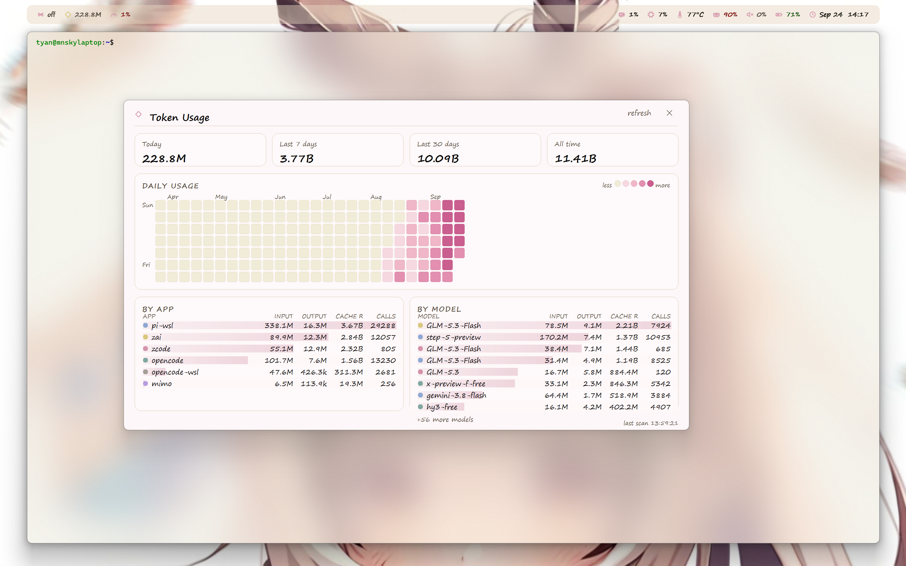
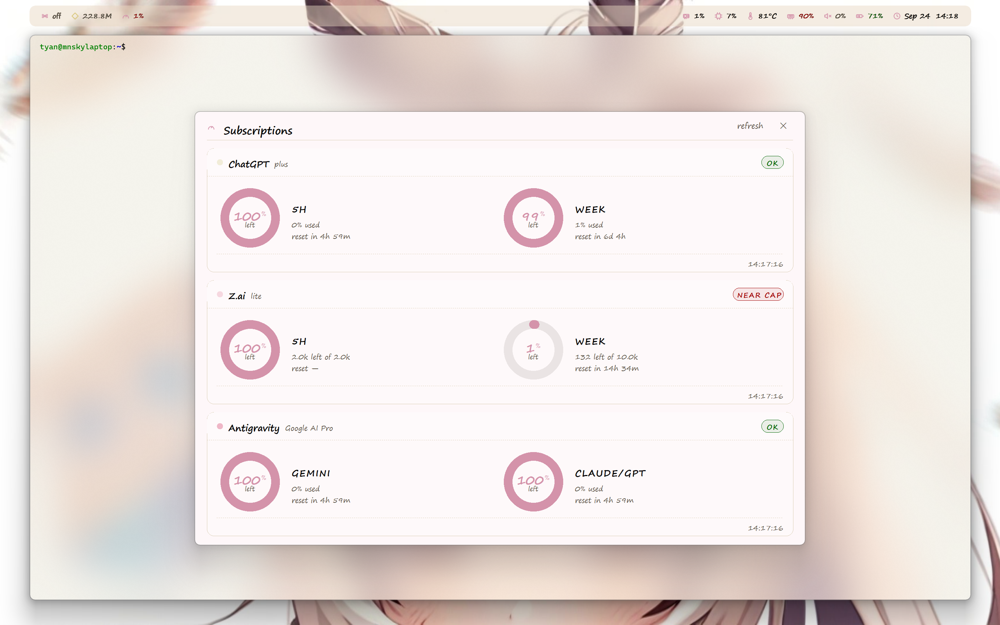

# Chocobar

Chocobar is a small bar that sticks to the top of your terminal window. While you work, it quietly shows your computer's health (CPU, memory, temperature, battery), how many AI tokens you have used, and how much of your subscription quota is left. It uses very little of your computer - about **30 MB of memory** and **4-5% of one CPU core** - so it can sit on your screen all day without slowing anything down. Everything is set up in one plain text file called `config.json`, and **your token counts stay on your own computer** - the bar reads the logs those tools already write on your disk and never uploads them. Off the shelf it makes no requests at all. Once you switch a subscription plan on, it asks that plan's own website how much quota you have left, using the login that plan already saved here, and that is the only request the bar itself ever makes - the only other way anything here reaches the network is a command you set up yourself, such as a custom chip or the shortcut button.

## What it looks like

The token dashboard - how many tokens you used today, this week, and over time, with a heatmap and a per-app breakdown:



The subscription board - how much of each plan's quota you have left, before you hit a limit:



## Features

Chocobar puts a thin, soft bar right above your terminal, and it follows that window as you move it around your screen - so it is always where you are already looking. On the bar sit small readouts for the things you care about while you work: your processor and graphics card, how much memory is free, how hot the CPU is running, the volume, the battery, and the time. Each one turns a warning color when it crosses a limit you choose, so a problem catches your eye before it becomes a surprise.

If you use AI coding tools, the bar keeps count for you. It reads the session logs those tools already write on your own disk and adds up how many tokens you have spent, then shows that on the bar and in a dashboard. The dashboard lays out your usage as a daily heatmap, summary cards for today and the last week and month, a breakdown by app and by model, and request counts. A separate board watches your subscription plans and shows, for each one, how much of each time window you have left - so you can see a plan nearing its cap at a glance instead of finding out when it stops working.

None of this is tied to one company or one tool. Every source - a token store, a subscription plan, even a custom chip that prints the output of any command you like - is declared by you in the config file, so a new tool is one small entry away, never a code change. The whole look is yours too: the colors, the font, the spacing, which chips appear, how rounded the corners are, and how see-through the bar is. A right-click menu gives you the two boards, a reload, and a quick way to edit the config, and every change applies the moment you save the file.

## Install and run

Chocobar is a native Win32 executable: one file, no runtime, no Electron, no
Node. Download `chocobar.exe` from the [latest release](https://github.com/mnsky-tyan/chocobar/releases/latest)
and run it.

It needs no installer and no administrator rights. On the first run it writes an
annotated config template to `%USERPROFILE%\.wizbar\config.json` and reads that
file from then on; every setting hot-reloads on save, so you can edit it while
the bar is running. To start over, delete the file and relaunch.

The bar follows the terminal window it sits on and hides when that window is
minimized. Right-click the bar (or its tray icon) for the tray menu: the two
dashboards, `Start with Windows`, `Edit config`, `Open config folder`,
`Check for updates`, `Reload` and `Quit`.

**Updating** is a manual step: pick `Check for updates` from the tray menu (it
opens the releases page), download the new `chocobar.exe`, quit the running bar
from its tray menu, replace the file, and run it again. Your config is untouched -
it lives in `%USERPROFILE%\.wizbar\`, never next to the executable.

### Build from source

`native/build.sh` assembles the parts in `native/src/` and cross-compiles with
the Nix mingw toolchain:

```bash
bash native/build.sh   # produces native/chocobar.exe
```

### Tests

```bash
npm test
```

## Configuration

The native bar keeps its whole configuration in one JSON file:

```
%USERPROFILE%\.wizbar\config.json
```

Point it somewhere else with `chocobar.exe --config <path>` or the `WIZBAR_CONFIG` environment variable (`--config` wins). The file is **hot-reloaded on save** - no restart. On first use of a path the bar writes an annotated template there; after that the bar never writes the file again, so hand edits, comments, and personal wiring all survive (the tray menu's `Start with Windows` item is the one setting that lives in the registry instead, precisely so it cannot be overwritten).

Everything below is optional: delete a key and the built-in default applies. Sizes are CSS pixels (the bar scales them by the display DPI), colors are `#RRGGBB`.

Every `Default` in the tables below is that built-in fallback, and so is the complete starting point at the end of this section. The template the bar writes on a first run ships a softer look on purpose - a taller bar, the `Segoe Print` font, a pastel tint - so that is what a new install opens with; deleting a key from it brings the fallback listed below back.

### `bar` - the strip itself

| Key | Default | What it does |
|---|---|---|
| `height` | `24` | Bar height in CSS px. |
| `gap` | `8` | Horizontal gap between chips, and the gap between dashboard panels. |
| `fontSize` | `12` | Chip text size. |
| `fontFamily` | `"Cascadia Mono"` | Chip font. Takes a CSS font stack (`"'Segoe Print', cursive"` works); empty falls back to Segoe UI. |
| `backgroundTint` | `"#FBF2E2"` | The cream tint you see through the acrylic. |
| `backgroundAlpha` | `110` | How solid the tint is (0-255). |
| `backdrop` | `"acrylic"` | `"acrylic"` for the blurred DWM backdrop, `"solid"` for a flat opaque bar. |
| `radius` | `8` | Corner radius, 0-26. |
| `align` | `1` | `1` = chips packed right (default), `2` = packed left. |

### `theme` - colors and icons

| Key | Default | What it does |
|---|---|---|
| `fg` | `"#080808"` | Primary text. |
| `fgDim` | `"#5a5245"` | Secondary text (subtitles, captions). |
| `pink` | `"#E8C7D0"` | Light pink (hover fills, accents). |
| `pinkDeep` | `"#D493AA"` | The signature pink: pie rings, check marks, highlights. |
| `pinkBg` | `"#FEF7F9"` | Dashboard page background. |
| `warn` | `"#A00000"` | Warning color (thresholds, near-cap). |
| `good` | `"#006400"` | Success color (OK pills, charging battery). |
| `yellow` | `"#B8A96A"` | Stale/neutral marker. |
| `divider` | `"#D9CCB2"` | Hairlines and dashed separators. |
| `iconColor` | `""` | Color of every built-in icon; empty follows `pinkDeep`. |
| `iconOpacity` | `90` | Icon opacity 0-100 (90 matches the Electron bar). |
| `heatmap` | 5 shades | The daily-heatmap ramp, light to dark. |
| `icons` | `[]` | Your own SVG icons, see below. |

**Own icons** - each entry in `theme.icons` defines a named icon in the same 24-unit viewBox the built-ins use, stroked with width `w`. Reference it from `modules.custom[].icon` by name; defining a name twice replaces it, so this is hot-reload friendly:

```json
"icons": [ { "name": "moon", "d": "M21 12.8A9 9 0 1 1 11.2 3a7 7 0 0 0 9.8 9.8z", "w": 2.2 } ]
```

### `modules` - the chips

Every module takes `enabled` (default `true` unless noted). The three leftmost toggles and the metric chips:

| Key | Default | What it does |
|---|---|---|
| `modules.gpu` | on | GPU usage chip (Windows Performance Counters). |
| `modules.cpu` | on | CPU usage chip. |
| `modules.cputemp` | on | CPU temperature chip (HWiNFO shared memory; `–` without it). |
| `modules.ram` | on | Memory usage chip. |
| `modules.volume` | on | System volume chip (Core Audio). |
| `modules.battery` | on | Battery chip. Green while charging, red only when low **and** on battery. |
| `modules.clock` | on | Local time; `format` below. |
| `modules.cpu.warnAt` | `85` | CPU % that turns the value red. |
| `modules.cputemp.warnAt` | `85` | Temperature (deg C) that turns red. |
| `modules.ram.warnAt` | `90` | Memory % that turns red. |
| `modules.clock.format` | `"{MMM} {dd} ({Wkk}) {HH}:{mm}"` | Clock format; `{Wkk}` is the weekday (`Mon`..`Sun`). |
| `modules.shortcut` | off | The bolt chip: `label` (chip text) and `command` (anything your shell can launch). |
| `modules.pet` | off | The bow chip: `label` (optional prefix), `exePath` (companion exe). Launches/stops it, state read from the live process. |
| `modules.custom` | `[]` | Your own chips, see below. |

**Custom chips** - each entry renders one more chip, right of the built-ins:

```json
{ "enabled": true, "icon": "moon", "label": "Focus", "color": "",
  "title": "Toggle the focus script", "toggle": true,
  "command": "C:\tools\focus.bat" }
```

- `icon`: a built-in name, a `theme.icons` name, a nerd-font glyph, or an emoji.
- `label`: chip text; empty = icon only. `color`: chip color; empty = theme default. `title`: hover tooltip.
- `command`: what a click runs. `toggle: true` holds an on/off state per run and appends ` on` / ` off` to the command.

**Command-output chips** - set `intervalMs` and the command is polled on a timer instead of on click, and its stdout becomes the chip text. This is the escape hatch for any metric the bar has no reader for:

```json
{ "enabled": true, "icon": "gpu", "label": "",
  "command": "nvidia-smi --query-gpu=temperature.gpu --format=csv,noheader",
  "intervalMs": 5000, "format": "$v C", "warnAbove": 80 }
```

- `intervalMs`: poll period (minimum 1000). The command runs through `cmd.exe /c`, so pipes and redirects work.
- `format`: wraps the value; `$v` is the trimmed stdout. Without `$v` the format is shown verbatim.
- `warnAbove` / `warnBelow`: colour the value red outside that band. Either alone is fine; omit both to disable. The band reads the command's raw output, and the colour starts on the first poll that produces output - a chip with no value yet never looks hot.

The poll runs on its own thread, so a command that takes a second never hitches the bar. A failed command keeps the last good text rather than blanking the chip.

### `tokens` - the usage dashboard

| Key | Default | What it does |
|---|---|---|
| `enabled` | `true` | Master switch: off = zero scans, no chip, empty dashboard. |
| `rescanMinutes` | `1` | Minutes between session-store scans (clamped 1-60). |
| `cachePath` | `""` | Usage-history seed file; empty = `~/.wizbar/token-cache.json`. |
| `appFilter` | `[]` | Harness allowlist: only these app ids are counted (empty = all). |
| `labels` | `{}` | Display names, e.g. `{ "pi": "pi-wsl" }`; aggregation keys stay raw. |
| `sources` | `[]` | Every session store the live scan reads - a user-declared array, see below. |

**`tokens.sources[]`** - the list of session stores, so tracking a new harness is a config line and nothing else. Up to 8 sources; extras are ignored with no error, so keep the list short enough to count.

```json
"sources": [
  { "app": "pi",  "path": "~/.pi/agent/sessions",  "enabled": true, "recursive": true },
  { "app": "zai", "path": "~/.zai/agent/sessions", "enabled": true }
]
```

- `app`: the aggregation key (and the `labels` lookup key), up to 19 characters - longer names are truncated at that, because every consumer of the key (the dashboard rows, the `appFilter`, the `labels` table) stores exactly that much. Omitted = the nearest dot-directory in the expanded path with its dot stripped, so `~/.pi/agent/sessions` becomes `pi` and `~/.claude/projects` becomes `claude`; a path with no dot-directory anywhere falls back to the store folder's own name.
- `path`: the store. `~` is profile-relative; a UNC path works too.
- `enabled`: per-source switch, honoured only when `tokens.enabled` is on.
- `recursive`: descend into per-project subdirectories. Defaults to **on** - a flat store has no subdirectories to descend into, a nested one needs it, so the default is right for both.
- `fields`: rename the usage keys for a harness that spells them differently, e.g. `{ "input": "prompt_tokens", "output": "completion_tokens" }`. The six keys are `input`, `output`, `cacheRead`, `cacheWrite`, `timestamp`, `model`; all default to the pi/zai spelling.

Usage semantics per store are in the Token accounting section below.

A config from before the array form (`"sources": { "pi": { "sessionsDir": ... } }`) is still read: each key becomes the app and its `sessionsDir` the store, and one log line says the legacy form was converted. Migrate to the array form at your convenience - entries without a `sessionsDir` (the old sqlite-backed stores) are skipped, as they always were.

### `subs` - the subscription board

| Key | Default | What it does |
|---|---|---|
| `enabled` | `false` | Master switch for the board and the gauge chip. |
| `intervalMinutes` | `2` | Minutes between quota polls. |
| `fetchTimeoutMs` | `20000` | Per-provider deadline: WinHTTP's connect and receive timeouts (resolve and send stay 5s). |
| `rotateSec` | `60` | Seconds each plan stays on the rotating gauge chip (5-3600). |
| `width` / `height` | `880` / `580` | Board window size in CSS px. |
| `providers` | `[]` | Up to 6 entries; the board fits every enabled one. |

Each provider entry:

```json
{ "type": "antigravity", "enabled": true, "label": "Antigravity",
  "authPath": "~/.pi/agent/auth.json",
  "clientId": "", "clientSecret": "" }
```

- `type`: `chatgpt` (reads `authPath`, a Codex CLI login), `zai` (reads `configPath` + `provider`), `antigravity` (reads `authPath`, a Google Cloud Code login), `generic` (a REST quota endpoint declared entirely in config, below).
- `vscdbPath`: Antigravity only - an IDE `state.vscdb` needle-scanned for an access token when `authPath` has none.
- `clientId` / `clientSecret`: **only** the Antigravity cloud fallback needs them (the token refresh pair). They are personal - keep them in your own config file, never in the repo.
- One `antigravity` entry renders ONE panel with two rows, Gemini and Claude/GPT, straight from `fetchAvailableModels` on both Google endpoints (the daily endpoint wins), the same source the harness's `/quota` uses - no IDE or language server required.

**`type: "generic"`** - any REST quota endpoint, declared entirely in config. This is what makes a new subscription plan a config edit rather than a code change:

```json
{ "type": "generic", "enabled": true, "label": "MyPlan",
  "url": "https://api.example.com/v1/quota", "method": "GET",
  "auth": { "header": "Authorization", "prefix": "Bearer ",
            "path": "~/.example/auth.json", "key": "access_token" },
  "headers": { "Accept": "application/json" },
  "windows": [
    { "label": "5h", "used": "$.data.five_hour.used",
      "total": "$.data.five_hour.limit", "reset": "$.data.five_hour.resets_at" },
    { "label": "week", "remaining": "$.data.weekly.remaining",
      "total": "$.data.weekly.limit" }
  ] }
```

- `url` / `method` / `body`: the request. `method` is `GET` unless it says `POST`; `body` is the raw POST body.
- `auth`: one object, or an array of them (up to 3 per provider). Each entry renders `header: prefix <value>`, where the value comes from `path` + `key` (read from a JSON file at fetch time), `env` (an environment variable), or `literal` (the config itself). Nothing is persisted. A `key` that starts with `$` is a JSON path, so a secret nested inside the file is reachable (`"auth": { "path": "~/x/auth.json", "key": "$.auth.token" }`); any other `key` is one flat top-level key.
- `headers`: static `Name: value` lines, sent after the resolved auth.
- `windows[]`: a `label` plus the JSON paths carrying the numbers, up to 6 per provider. Paths are `$.a.b[0].c`. A window needs any two of `used` / `remaining` / `total`; the third is derived. `reset` is an ISO-8601 timestamp.
- `require`: a path that must be present, for endpoints that answer `200` with an error body.
- `insecure`: authorize plain `http` (the scheme decides TLS; without this flag an `http://` URL is refused). Documented risk: it sends the token in the clear.

**Layout across 0-5 providers**: zero providers shows the `No providers enabled.` empty state; each enabled provider gets one full-width panel with its quota windows side by side inside; with five the panels compress just enough that all five fit one screen (nothing is dropped). A failed poll keeps the last good windows marked stale.

### `dashboard`, `terminal`, `general`

| Key | Default | What it does |
|---|---|---|
| `dashboard.width` / `dashboard.height` | `900` / `520` | Token dashboard window size. |
| `terminal.className` | `""` | Pin one terminal window class (Win32 class name). Empty = probe Windows Terminal, conhost, ConEmu, mintty, then WezTerm/Alacritty/Hyper by process. |
| `terminal.title` | `""` | Optional title substring to disambiguate. |
| `general.showTray` | `true` | Show the tray icon. |
| `general.autoStart` | `true` | **First-run only** default for the `Start with Windows` menu item (writes the HKCU Run value). After the first run the menu is the control. |
| `general.debug` | `false` | Verbose `[wizbar]` logging to `~/.wizbar/native.log`. |

### Keys the native build ignores

The bar grew out of an Electron app, and a few old keys still appear in configs from that era. The native parser does not read them: `bar.position`, `bar.insetX`, `bar.segmentSpacing`, `bar.roundCorners`, `modules.bluetooth`, `tokens.showOnBar`, `tokens.dashboard`, `tokens.heatmapDays`, `tokens.sources.zcode` / `tokens.sources.opencode` (those two stores come from the `cachePath` seed, as the retired app last wrote them; the legacy `sources` object itself is converted, but these two keys carry no `sessionsDir`, so nothing scans them), `theme.surfaces`, `terminal.reattachToExisting`. Deleting them is safe; adding them back does nothing.

### A complete starting point

```json
{
  "bar": { "height": 24, "gap": 8, "fontSize": 12, "fontFamily": "Cascadia Mono",
           "backgroundTint": "#FBF2E2", "backgroundAlpha": 110,
           "backdrop": "acrylic", "radius": 8, "align": 1 },
  "theme": { "fg": "#080808", "fgDim": "#5a5245", "pink": "#E8C7D0",
             "pinkDeep": "#D493AA", "warn": "#A00000", "good": "#006400",
             "divider": "#D9CCB2", "iconColor": "", "iconOpacity": 90,
             "heatmap": ["#F1ECD8", "#F6D8E0", "#EFB7C7", "#E28FB0", "#C95E8F"] },
  "dashboard": { "width": 900, "height": 520 },
  "modules": {
    "gpu": { "enabled": true },
    "cpu":  { "enabled": true, "warnAt": 85 },
    "cputemp": { "enabled": true, "warnAt": 85 },
    "ram":  { "enabled": true, "warnAt": 90 },
    "volume": { "enabled": true },
    "battery": { "enabled": true },
    "clock": { "enabled": true, "format": "{MMM} {dd} ({Wkk}) {HH}:{mm}" },
    "shortcut": { "enabled": false, "label": "", "command": "" },
    "pet": { "enabled": false, "label": "", "exePath": "" },
    "custom": [ { "enabled": true, "icon": "moon", "label": "Focus",
                  "command": "C:\tools\focus.bat", "toggle": true } ]
  },
  "tokens": { "enabled": true, "appFilter": [], "cachePath": "",
              "labels": { "pi": "pi-wsl" },
              "sources": [ { "app": "zai", "path": "~/.zai/agent/sessions", "enabled": true },
                           { "app": "pi",  "path": "~/.pi/agent/sessions", "enabled": true,
                             "recursive": true } ] },
  "subs": { "enabled": false, "intervalMinutes": 2, "fetchTimeoutMs": 20000,
            "rotateSec": 60, "width": 880, "height": 580,
            "providers": [
              { "type": "chatgpt", "enabled": false, "label": "ChatGPT",
                "authPath": "~/.codex/auth.json" },
              { "type": "zai", "enabled": false, "label": "Z.ai",
                "configPath": "~/.zcode/v2/config.json",
                "provider": "builtin:zai-coding-plan" },
              { "type": "antigravity", "enabled": false, "label": "Antigravity",
                "authPath": "~/.pi/agent/auth.json",
                "clientId": "", "clientSecret": "" },
              { "type": "generic", "enabled": false, "label": "MyPlan",
                "url": "https://api.example.com/v1/quota", "method": "GET",
                "auth": { "header": "Authorization", "prefix": "Bearer ",
                          "path": "~/.example/auth.json", "key": "access_token" },
                "headers": { "Accept": "application/json" },
                "windows": [
                  { "label": "5h", "used": "$.data.five_hour.used",
                    "total": "$.data.five_hour.limit",
                    "reset": "$.data.five_hour.resets_at" },
                  { "label": "week", "remaining": "$.data.weekly.remaining",
                    "total": "$.data.weekly.limit" }
                ] }
            ] },
  "terminal": { "className": "", "title": "" },
  "general": { "showTray": true, "autoStart": true, "debug": false }
}
```

## Token accounting

Every total in the bar and dashboard follows the common usage-dashboard convention (ccusage & co):

```
total = input + output + cache read + cache write
```

The total counts every token the provider processed. The `input` and `output` columns are the raw, cache-EXCLUSIVE counts, and the `cache R` / `cache W` columns break the rest of the total down - together they sum to the total, with nothing hidden and nothing doubled. Reasoning tokens, where a store reports them separately, are stored as a breakdown only and never added (providers include them in their own totals).

This is the general convention - the providers themselves total it this way, verified on real stores:

- pi/zai transcripts: the provider's own `usage.totalTokens` equals `input + output + cacheRead + cacheWrite` exactly on every record checked.
- opencode: the store's own `tokens.total` equals `input + output + cache.read + cache.write` on sampled rows (outliers differ by exactly their `reasoning` - opencode adds reasoning to its total, we keep it as a breakdown).
- zcode DB: `computed_total_tokens` equals `input_tokens + output_tokens + reasoning_tokens`, and `input_tokens` already contains the cache columns - i.e. the DB's own total includes cache too.
- ccusage, the reference usage dashboard for Claude-shaped APIs, defines its Total column the same way (input + output + cache creation + cache read).

Per source, the raw numbers come from the provider's own usage records:

| Source | Record read | Provider-reported semantics | Stored input (raw) |
|---|---|---|---|
| `zcode` (+ legacy `zai` DB turns) | `turn_usage` row in the zcode SQLite DB | `computed_total_tokens == input_tokens + output_tokens + reasoning_tokens`, so `input_tokens` already INCLUDES the cache columns | `input_tokens - cacheWrite - cacheRead` |
| `zai` / `pi` sessions | assistant `message.usage` in the session JSONL | `usage.totalTokens == input + output + cacheRead + cacheWrite`, so `input` EXCLUDES cache | `usage.input` as stored |
| `opencode` | assistant message `tokens` in the SQLite `message.data` JSON (or the legacy `msg_*.json` tree) | `input + output + cache.read + cache.write` (input excludes cache) | `tokens.input` as stored |
| `mimo` | assistant message `tokens` from the local desktop API | `input + output + cache.read + cache.write` (input excludes cache) | `tokens.input` as stored |
| `subscription` | your plan-usage JSON (`used` / `total` per plan) | n/a (credits, not tokens) | never mixed into token totals |

Exact read sites, for reference:

- zcode: `scripts/zcode_query.py` (the SQL) and `_scanZcode` in `src/tokens.js`
- zai/pi sessions: `_readSessionTail` in `src/tokens.js`
- opencode: `_scanOpencodeDb` / `_scanOpencodeFiles` in `src/tokens.js`
- mimo: `_scanMimo` in `src/tokens.js`
- aggregation: `aggregate()` in `src/tokens.js` (`rowTotal = input + output + cacheRead + cacheWrite`)

`npm test` cross-checks the scanner against a raw walk of a real session store: record counts and per-column sums must match exactly, and the portable suite pins the aggregation contract (totals include cache; input/output columns stay raw).

## Use the bar and dashboard

- Click the diamond (tokens) chip or use `Ctrl+Alt+D` to open the dashboard.
- Double-launch Chocobar to open the dashboard when it is already running.
- Right-click the bar or tray icon for dashboards, reload, config, and quit actions; the menu closes on an outside click or Esc.
- The clock format supports `{Wkk}` (weekday, `Mon`..`Sun`), for example `{MMM} {dd} ({Wkk}) {HH}:{mm}` renders `Sep 17 (Thu) 23:33` in local time.
- The bar follows the terminal you are in: the foreground window wins when it is a supported terminal, otherwise the first match in probe order. With the default empty `terminal.className`, it probes common terminals in documented order. Following is sticky - the bar keeps one terminal until it closes, then re-probes (foreground terminal first).
- If there is no room above a terminal, the bar hides until room returns instead of relocating unexpectedly.
- Launch with a specific config file: `chocobar --config <path>` (or the `WIZBAR_CONFIG` environment variable). The file gets the annotated template on first use, so personal wiring stays in personal files while a fresh install just works.

## Defaults and privacy

The shipped defaults read nothing: every usage source and board provider is switched off, so an untouched install performs no scan and no request even though the template names example store paths. The three toggle chips are visible so you can find them; with nothing wired they show `–` / `—` and scan nothing. Chocobar has no telemetry. Enabled sources are read-only and local, except for an explicitly enabled local desktop API adapter.

Internal compatibility paths and filenames still use `wizbar`, including `~/.wizbar` and `start-wizbar.vbs`. The application and all user-visible strings use Chocobar.

## Tests

Tests are headless, use a temporary HOME, and require no GUI:

```bash
npm test
```

The suite covers portable readers, neutral defaults, token aggregation, subscription snapshots, terminal probe resolution, and session-log scanning. Windows-only checks cover native sensor providers.

## Layout

```text
main.js            app entry, tray, IPC, lifecycle, and reload action
src/config.js      defaults and hot-reloaded user config
src/tracker.js     terminal detection and follow state machine
src/native.js      native bindings and portable readers
src/metrics.js     system metric polling
src/tokens.js      local usage adapters and aggregation
src/bar.js         bar BrowserWindow
renderer/          bar and dashboard HTML, CSS, JavaScript, and preloads
scripts/           launchers and regression suites
```
